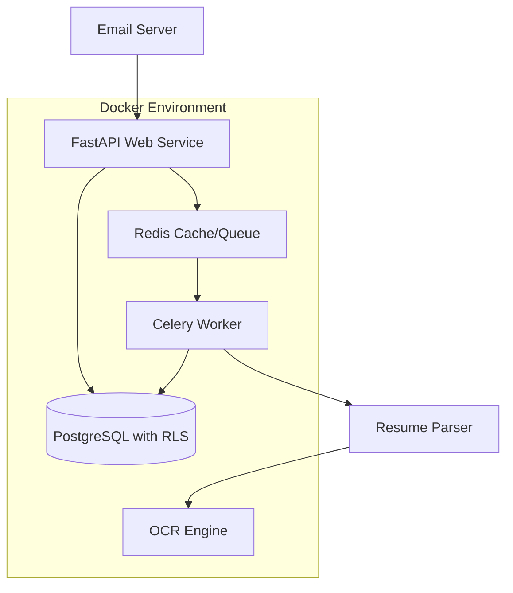

# Design Document

## Overview

The ATS Backend System is a multi-tenant applicant tracking system built with a microservices architecture. The system processes resumes through email ingestion, uses intelligent parsing with OCR capabilities, and maintains strict data isolation using PostgreSQL Row-Level Security (RLS). The architecture consists of a FastAPI web service, Celery workers for background processing, PostgreSQL database with RLS policies, and Redis for caching and task queuing.

## Architecture

The system follows a distributed architecture with the following key components:



### Component Responsibilities

- **FastAPI Web Service**: REST API endpoints, authentication, email ingestion
- **Celery Workers**: Background resume processing, parsing, OCR operations
- **PostgreSQL with RLS**: Multi-tenant data storage with automatic isolation
- **Redis**: Task queue management and caching layer
- **Resume Parser**: Text extraction, structured data parsing, skill identification
- **OCR Engine**: Image-to-text conversion for scanned documents

## Components and Interfaces

### API Layer

- **Email Ingestion Endpoint**: Receives emails with resume attachments
- **CRUD Endpoints**: Candidate and application management
- **Authentication Middleware**: Client identification and session management
- **Multi-tenant Context**: Sets database session for RLS enforcement

### Worker Layer

- **Resume Processing Tasks**: Asynchronous document parsing
- **OCR Processing**: Image-based resume text extraction
- **Duplicate Detection**: Fuzzy matching for candidate identification
- **Error Handling**: Retry logic and failure notifications

### Data Layer

- **RLS Policies**: Automatic client data isolation
- **Audit Logging**: Change tracking and compliance
- **Soft Deletes**: Historical record preservation
- **JSONB Storage**: Flexible skill and metadata storage

## Data Models

### Core Entities

```sql
-- Clients (Tenant Organizations)
CREATE TABLE clients (
    id UUID PRIMARY KEY DEFAULT gen_random_uuid(),
    name VARCHAR(255) NOT NULL,
    email_domain VARCHAR(255),
    created_at TIMESTAMP DEFAULT NOW(),
    updated_at TIMESTAMP DEFAULT NOW()
);

-- Candidates
CREATE TABLE candidates (
    id UUID PRIMARY KEY DEFAULT gen_random_uuid(),
    client_id UUID NOT NULL REFERENCES clients(id),
    name VARCHAR(255) NOT NULL,
    email VARCHAR(255),
    phone VARCHAR(50),
    skills JSONB,
    experience JSONB,
    ctc_current DECIMAL(12,2),
    ctc_expected DECIMAL(12,2),
    status VARCHAR(50) DEFAULT 'ACTIVE',
    candidate_hash VARCHAR(64), -- For duplicate detection
    created_at TIMESTAMP DEFAULT NOW(),
    updated_at TIMESTAMP DEFAULT NOW()
);

-- Applications
CREATE TABLE applications (
    id UUID PRIMARY KEY DEFAULT gen_random_uuid(),
    client_id UUID NOT NULL REFERENCES clients(id),
    candidate_id UUID NOT NULL REFERENCES candidates(id),
    job_title VARCHAR(255),
    application_date TIMESTAMP DEFAULT NOW(),
    status VARCHAR(50) DEFAULT 'RECEIVED',
    flagged_for_review BOOLEAN DEFAULT FALSE,
    flag_reason TEXT,
    deleted_at TIMESTAMP NULL, -- Soft delete
    created_at TIMESTAMP DEFAULT NOW(),
    updated_at TIMESTAMP DEFAULT NOW()
);

-- Resume Processing Jobs
CREATE TABLE resume_jobs (
    id UUID PRIMARY KEY DEFAULT gen_random_uuid(),
    client_id UUID NOT NULL REFERENCES clients(id),
    email_message_id VARCHAR(255) UNIQUE, -- Deduplication
    file_name VARCHAR(255),
    file_path TEXT,
    status VARCHAR(50) DEFAULT 'PENDING',
    error_message TEXT,
    processed_at TIMESTAMP,
    created_at TIMESTAMP DEFAULT NOW()
);
```

### RLS Policies

```sql
-- Enable RLS on all tenant tables
ALTER TABLE candidates ENABLE ROW LEVEL SECURITY;
ALTER TABLE applications ENABLE ROW LEVEL SECURITY;
ALTER TABLE resume_jobs ENABLE ROW LEVEL SECURITY;

-- Create policies for client isolation
CREATE POLICY client_isolation_candidates ON candidates
    FOR ALL TO authenticated_users
    USING (client_id = current_setting('app.current_client_id')::UUID);

CREATE POLICY client_isolation_applications ON applications
    FOR ALL TO authenticated_users
    USING (client_id = current_setting('app.current_client_id')::UUID);

CREATE POLICY client_isolation_resume_jobs ON resume_jobs
    FOR ALL TO authenticated_users
    USING (client_id = current_setting('app.current_client_id')::UUID);
```

## Correctness Properties

_A property is a characteristic or behavior that should hold true across all valid executions of a system-essentially, a formal statement about what the system should do. Properties serve as the bridge between human-readable specifications and machine-verifiable correctness guarantees._

After reviewing the acceptance criteria, I've identified several properties that can be consolidated to eliminate redundancy:

**Property Reflection:**

- Properties 3.2 and 3.3 can be combined into a comprehensive RLS enforcement property
- Properties 4.1 and 4.2 can be combined into a comprehensive CRUD operations property
- Properties 6.1, 6.3, and 6.5 can be combined into a comprehensive duplicate detection property
- Properties 7.1, 7.2, and 7.3 can be combined into a comprehensive logging property

### Email Processing Properties

**Property 1: Email attachment extraction completeness**
_For any_ email with resume attachments, all attached files should be extracted and queued for processing within 30 seconds
**Validates: Requirements 1.1, 1.2**

**Property 2: File format support**
_For any_ resume file in supported formats (PDF, PNG, JPG, TIFF), the system should successfully process the file without format-related errors
**Validates: Requirements 1.3**

**Property 3: Multiple attachment processing**
_For any_ email containing N resume attachments, exactly N separate candidate applications should be created
**Validates: Requirements 1.4**

**Property 4: Email deduplication**
_For any_ email message ID, sending the same email multiple times should result in only one processing job being created
**Validates: Requirements 1.5**

### Resume Parsing Properties

**Property 5: Text extraction completeness**
_For any_ PDF resume (text-based or image-based), the parser should extract readable text content using appropriate methods (direct parsing or OCR)
**Validates: Requirements 2.1, 2.2**

**Property 6: Structured data extraction**
_For any_ resume containing candidate information, the parser should extract and store name, email, phone number, work experience, and skills in the correct database fields and formats
**Validates: Requirements 2.3, 2.4**

**Property 7: Salary normalization**
_For any_ resume containing salary information in various formats, the parser should extract and normalize CTC values to a consistent decimal format
**Validates: Requirements 2.5**

### Multi-tenant Security Properties

**Property 8: Client session context**
_For any_ authenticated client user, the database session context should be set to that client's identifier
**Validates: Requirements 3.1**

**Property 9: RLS data isolation**
_For any_ database query executed by a client, the results should only include data belonging to that client, and attempts to access other clients' data should return no results
**Validates: Requirements 3.2, 3.3**

**Property 10: Automatic client association**
_For any_ new candidate or application record created, it should be automatically associated with the authenticated client's identifier
**Validates: Requirements 3.4**

### CRUD Operations Properties

**Property 11: Candidate CRUD completeness**
_For any_ candidate record, the system should support create, read, update operations with proper validation, data integrity, and audit trail maintenance
**Validates: Requirements 4.1, 4.2, 4.3**

**Property 12: Soft delete preservation**
_For any_ application deletion request, the record should be marked as deleted (soft delete) while preserving the historical data
**Validates: Requirements 4.4**

**Property 13: API authentication and authorization**
_For any_ API request, the system should authenticate the user and enforce client-specific access controls
**Validates: Requirements 4.5**

### Duplicate Detection Properties

**Property 14: Comprehensive duplicate detection**
_For any_ new resume being processed, the system should check for existing candidates using fuzzy matching on name, email, and phone number, maintain candidate hash values for efficient matching, and flag applications for manual review when matches with "LEFT" status are found
**Validates: Requirements 6.1, 6.2, 6.3, 6.5**

**Property 15: Workflow progression control**
_For any_ flagged candidate application, automatic hiring workflow progression should be prevented
**Validates: Requirements 6.4**

### Logging and Monitoring Properties

**Property 16: Comprehensive system logging**
_For any_ system operation (email ingestion, resume parsing, database modifications), appropriate log entries should be created with timestamps, identifiers, and error details when applicable
**Validates: Requirements 7.1, 7.2, 7.3**

**Property 17: Health monitoring**
_For any_ system health check request, the status of all critical services should be reported
**Validates: Requirements 7.4**

**Property 18: Performance metrics tracking**
_For any_ system operation, processing times and queue depths should be tracked and available for monitoring
**Validates: Requirements 7.5**

## Error Handling

### Email Processing Errors

- **Invalid file formats**: Log error and skip processing with notification
- **Corrupted attachments**: Retry with different parsing methods, escalate if persistent
- **Email server connectivity**: Implement exponential backoff retry mechanism
- **Storage failures**: Queue for retry with persistent storage backup

### Resume Parsing Errors

- **OCR failures**: Fallback to manual processing queue with human review
- **Malformed documents**: Log detailed error information and flag for manual review
- **Missing required fields**: Create partial candidate record with validation warnings
- **Parsing timeouts**: Implement configurable timeout limits with retry logic

### Database Errors

- **Connection failures**: Implement connection pooling with automatic reconnection
- **RLS policy violations**: Log security events and return appropriate error responses
- **Constraint violations**: Provide detailed validation error messages to API consumers
- **Transaction failures**: Implement rollback mechanisms with data consistency checks

### Multi-tenant Errors

- **Authentication failures**: Log security events and implement rate limiting
- **Authorization violations**: Audit log access attempts and block unauthorized requests
- **Client context errors**: Fail-safe to prevent cross-tenant data exposure
- **Session management**: Implement secure session handling with automatic cleanup

## Testing Strategy

The testing approach combines unit testing for specific functionality with property-based testing for universal correctness guarantees.

### Unit Testing Approach

- **API endpoint testing**: Verify specific request/response scenarios
- **Database integration**: Test specific CRUD operations and RLS policies
- **Email processing**: Test specific email formats and attachment scenarios
- **Error conditions**: Test specific failure modes and error handling paths
- **Authentication flows**: Test specific login and authorization scenarios

### Property-Based Testing Approach

- **Framework**: Use Hypothesis for Python to generate test cases automatically
- **Test configuration**: Run minimum 100 iterations per property test to ensure statistical confidence
- **Generator strategy**: Create smart generators that produce realistic test data within valid input domains
- **Property validation**: Each property-based test must validate one specific correctness property from the design document

### Property-Based Test Requirements

- Each property-based test must be tagged with: **Feature: ats-backend, Property {number}: {property_text}**
- Tests must reference the specific correctness property they implement
- Generators should create realistic data (valid email formats, proper resume structures, etc.)
- Properties should test the universal behavior across all valid inputs
- Failed property tests must provide clear counterexamples for debugging

### Test Coverage Strategy

- **Email ingestion**: Property tests for attachment processing, deduplication, format support
- **Resume parsing**: Property tests for text extraction, data structure validation, salary normalization
- **Multi-tenant security**: Property tests for RLS enforcement, client isolation, session management
- **CRUD operations**: Property tests for data integrity, audit trails, soft deletes
- **Duplicate detection**: Property tests for fuzzy matching, hash generation, flagging logic
- **Logging and monitoring**: Property tests for log completeness, health checks, metrics tracking

The combination of unit tests and property-based tests ensures both specific functionality works correctly and universal properties hold across all possible inputs, providing comprehensive correctness validation for the ATS backend system.
