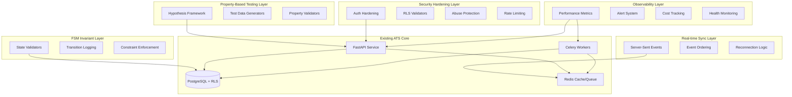

# Design Document

## Overview

The Production Hardening System transforms the existing ATS backend from a working prototype into a mathematically guaranteed, production-ready system. This system implements comprehensive property-based testing using Hypothesis, hardens security boundaries to prevent any RLS bypass, enforces FSM invariants through database constraints, provides real-time synchronization with guaranteed ordering, and establishes comprehensive observability with disaster recovery capabilities.

The hardening approach focuses on five core pillars: **Mathematical Correctness** (property-based testing), **Security Guarantees** (zero bypass tolerance), **State Integrity** (FSM invariants), **Real-time Reliability** (SSE with ordering), and **Operational Excellence** (observability and recovery).
Mathematical guarantees are enforced through database constraints, FSM transition guards, and property-based testing over randomized input spaces.

## Architecture

The production hardening system extends the existing ATS architecture with additional layers for testing, security, monitoring, and operational reliability:



### Hardening Components

- **Property-Based Testing Framework**: Hypothesis-driven validation of all 18 correctness properties
- **Security Hardening Module**: Authentication fixes, RLS validation, abuse protection
- **FSM Invariant Engine**: Database constraints and state transition validation
- **Real-time Sync Manager**: SSE with guaranteed ordering and reconnection
- **Observability Platform**: Comprehensive metrics, alerting, and cost control
- **Disaster Recovery System**: Automated backup, restore, and environment management

## Components and Interfaces

### Property-Based Testing Framework

**Hypothesis Integration**:

- Test configuration with minimum 100 iterations per property
- Deterministic seeded runs for CI reproducibility
- Smart generators for realistic test data (tenants, candidates, resumes)
- Property validation with clear counterexample reporting

**Test Data Generators**:

```python
# Randomized tenant generator
@composite
def tenant_strategy(draw):
    return {
        "id": draw(uuids()),
        "name": draw(text(min_size=1, max_size=100)),
        "email_domain": draw(email_domains())
    }

# Randomized candidate generator
@composite
def candidate_strategy(draw):
    return {
        "name": draw(names()),
        "email": draw(emails()),
        "phone": draw(phone_numbers()),
        "skills": draw(lists(text(min_size=1), min_size=0, max_size=20)),
        "experience": draw(experience_records())
    }
```

**Property Validators**:

- Each of the 18 existing properties implemented as Hypothesis tests
- Comprehensive input space coverage through smart generation
- Failure analysis with detailed counterexample logging

### Security Hardening Module

**Authentication Hardening**:

```python
# Pre-hash long passwords before bcrypt
def secure_password_hash(password: str) -> str:
    if len(password.encode('utf-8')) > 72:
        # Pre-hash with SHA-256 to avoid bcrypt limitation
        import hashlib
        password = hashlib.sha256(password.encode('utf-8')).hexdigest()
    return bcrypt.hashpw(password.encode('utf-8'), bcrypt.gensalt())

# Token replay prevention
class TokenReplayProtection:
    def __init__(self, redis_client):
        self.redis = redis_client
        self.token_ttl = 3600  # 1 hour

    async def validate_token_usage(self, token_jti: str) -> bool:
        key = f"token_used:{token_jti}"
        if await self.redis.exists(key):
            return False  # Token already used
        await self.redis.setex(key, self.token_ttl, "1")
        return True
```

**Abuse Protection**:

```python
# Rate limiting configuration
RATE_LIMITS = {
    "email_ingestion": "10/minute",  # Per IP
    "api_requests": "1000/hour",     # Per client
    "login_attempts": "5/minute",    # Per IP
}

# File validation
MAX_ATTACHMENT_SIZE = 50 * 1024 * 1024  # 50MB
ALLOWED_MIME_TYPES = {
    "application/pdf",
    "image/png", "image/jpeg", "image/tiff"
}
MAX_RESUMES_PER_EMAIL = 10
```

### FSM Invariant Engine

**Database Constraints**:

```sql
-- Ensure LEFT_COMPANY implies blacklisted
ALTER TABLE candidates
ADD CONSTRAINT check_left_company_blacklisted
CHECK (status != 'LEFT_COMPANY' OR is_blacklisted = TRUE);

-- Prevent skipping JOINED state
CREATE OR REPLACE FUNCTION validate_status_transition()
RETURNS TRIGGER AS $$
BEGIN
    -- Validate state transitions
    IF OLD.status = 'ACTIVE' AND NEW.status = 'LEFT_COMPANY' THEN
        -- Must have been JOINED first
        IF NOT EXISTS (
            SELECT 1 FROM audit_logs
            WHERE table_name = 'candidates'
            AND record_id = NEW.id
            AND changes->>'status' = 'JOINED'
        ) THEN
            RAISE EXCEPTION 'Cannot transition to LEFT_COMPANY without JOINED state';
        END IF;
    END IF;
    RETURN NEW;
END;
$$ LANGUAGE plpgsql;

CREATE TRIGGER candidate_status_transition_trigger
    BEFORE UPDATE ON candidates
    FOR EACH ROW
    EXECUTE FUNCTION validate_status_transition();
```

**State Transition Logging**:

```python
class FSMTransitionLogger:
    def log_transition(self, candidate_id: UUID, old_status: str,
                      new_status: str, actor_id: UUID, reason: str):
        audit_entry = {
            "timestamp": datetime.utcnow(),
            "candidate_id": candidate_id,
            "transition": f"{old_status} -> {new_status}",
            "actor_id": actor_id,
            "reason": reason,
            "is_terminal": new_status == "LEFT_COMPANY"
        }
        # Store in audit log with FSM-specific metadata
```

### Real-time Sync Manager

**SSE Implementation**:

```python
class SSEManager:
    def __init__(self, redis_client):
        self.redis = redis_client
        self.channels = {}  # tenant_id -> channel

    async def publish_event(self, tenant_id: UUID, event: dict):
        # Ensure ordering per application
        event["sequence"] = await self._get_next_sequence(
            tenant_id, event.get("application_id")
        )
        event["timestamp"] = time.time()

        channel = f"hr_events:{tenant_id}"
        await self.redis.publish(channel, json.dumps(event))

    async def _get_next_sequence(self, tenant_id: UUID, app_id: UUID) -> int:
        key = f"seq:{tenant_id}:{app_id}"
        return await self.redis.incr(key)
```

**Event Ordering Guarantees**:

- Per-application sequence numbers stored in Redis
- Idempotent event handling on frontend
- Automatic gap detection and recovery
- Connection state management with heartbeat

### Observability Platform

**Performance Metrics**:

```python
class ProductionMetrics:
    def __init__(self):
        self.metrics = {
            "resume_parse_time_p50": Histogram("resume_parse_seconds", buckets=[0.1, 0.5, 1.0, 5.0, 10.0]),
            "resume_parse_time_p95": Histogram("resume_parse_seconds", buckets=[0.1, 0.5, 1.0, 5.0, 10.0]),
            "ocr_fallback_rate": Counter("ocr_fallback_total"),
            "duplicate_detection_hit_rate": Counter("duplicate_hits_total"),
            "queue_depth": Gauge("queue_depth_current"),
            "failed_ingestion_count": Counter("ingestion_failures_total")
        }

    def track_resume_parsing(self, duration: float, used_ocr: bool):
        self.metrics["resume_parse_time_p50"].observe(duration)
        self.metrics["resume_parse_time_p95"].observe(duration)
        if used_ocr:
            self.metrics["ocr_fallback_rate"].inc()
```

**Alert Configuration**:

```python
ALERTS = {
    "resume_backlog_high": {
        "condition": "queue_depth > 100",
        "severity": "warning",
        "notification": ["email", "slack"]
    },
    "ocr_failure_spike": {
        "condition": "rate(ocr_failures[5m]) > 0.1",
        "severity": "critical",
        "notification": ["email", "slack", "pagerduty"]
    },
    "rls_misconfiguration": {
        "condition": "zero_row_access_rate > 0.05",
        "severity": "critical",
        "notification": ["email", "slack", "pagerduty"]
    }
}
```

## Data Models

### Property Test Results

```python
class PropertyTestResult(Base):
    __tablename__ = "property_test_results"

    id = Column(UUID, primary_key=True, default=uuid4)
    property_name = Column(String(255), nullable=False)
    test_run_id = Column(String(255), nullable=False)
    status = Column(Enum("PASSED", "FAILED", "SKIPPED"), nullable=False)
    iterations = Column(Integer, nullable=False)
    counterexample = Column(JSON, nullable=True)
    execution_time = Column(Float, nullable=False)
    created_at = Column(DateTime, default=datetime.utcnow)
```

### Security Audit Log

```python
class SecurityAuditLog(Base):
    __tablename__ = "security_audit_logs"

    id = Column(UUID, primary_key=True, default=uuid4)
    event_type = Column(String(100), nullable=False)  # "auth_failure", "rls_bypass_attempt", etc.
    severity = Column(Enum("LOW", "MEDIUM", "HIGH", "CRITICAL"), nullable=False)
    client_id = Column(UUID, nullable=True)
    user_id = Column(UUID, nullable=True)
    ip_address = Column(String(45), nullable=True)
    user_agent = Column(Text, nullable=True)
    details = Column(JSON, nullable=False)
    created_at = Column(DateTime, default=datetime.utcnow)
```

### FSM Transition Log

```python
class FSMTransitionLog(Base):
    __tablename__ = "fsm_transition_logs"

    id = Column(UUID, primary_key=True, default=uuid4)
    candidate_id = Column(UUID, ForeignKey("candidates.id"), nullable=False)
    old_status = Column(String(50), nullable=False)
    new_status = Column(String(50), nullable=False)
    actor_id = Column(UUID, nullable=False)
    actor_type = Column(Enum("USER", "SYSTEM"), nullable=False)
    reason = Column(Text, nullable=False)
    is_terminal = Column(Boolean, default=False)
    created_at = Column(DateTime, default=datetime.utcnow)
```

### Performance Metrics

```python
class PerformanceMetric(Base):
    __tablename__ = "performance_metrics"

    id = Column(UUID, primary_key=True, default=uuid4)
    metric_name = Column(String(100), nullable=False)
    metric_value = Column(Float, nullable=False)
    metric_unit = Column(String(20), nullable=False)
    client_id = Column(UUID, nullable=True)
    additional_tags = Column(JSON, nullable=True)
    recorded_at = Column(DateTime, default=datetime.utcnow)
```

## Correctness Properties

_A property is a characteristic or behavior that should hold true across all valid executions of a system-essentially, a formal statement about what the system should do. Properties serve as the bridge between human-readable specifications and machine-verifiable correctness guarantees._

Now I'll analyze the acceptance criteria from the requirements to identify testable properties:
After reviewing the acceptance criteria, I've identified several properties that can be consolidated to eliminate redundancy:

**Property Reflection:**

- Properties 1.1, 1.2, 1.3, and 1.5 can be combined into a comprehensive property-based testing framework property
- Properties 2.1, 2.2, 2.3, 2.4, and 2.5 can be combined into a comprehensive security hardening property
- Properties 3.1, 3.2, 3.3, 3.4, and 3.5 can be combined into a comprehensive FSM invariant property
- Properties 4.1, 4.2, 4.3, 4.4, and 4.5 can be combined into a comprehensive real-time sync property
- Properties 5.1, 5.2, 5.3, and 5.5 can be combined into a comprehensive observability property
- Properties 7.1, 7.2, 7.3, and 7.4 can be combined into a comprehensive security validation property
- Properties 8.2, 8.3, and 8.4 can be combined into a comprehensive system robustness property

### Property-Based Testing Framework Properties

**Property 1: Comprehensive property test framework**
_For any_ property-based test execution, the system should use Hypothesis framework with randomized data generation, run at least 100 iterations, use deterministic seeded runs for reproducibility, and avoid hardcoded test data
**Validates: Requirements 1.1, 1.2, 1.3, 1.5**

### Security Hardening Properties

**Property 2: Comprehensive authentication security**
_For any_ password processing, token validation, or authentication attempt, the system should handle long passwords without bcrypt errors, prevent token replay attacks, reject expired tokens with security logging, and enforce proper rate limiting and lockout mechanisms
**Validates: Requirements 2.1, 2.2, 2.3, 7.4**

**Property 3: RLS bypass prevention**
_For any_ client token or database access attempt, the system should prevent cross-client data access through RLS policies and block all SQL injection or bypass attempts
**Validates: Requirements 2.4, 7.2**

**Property 4: Abuse protection enforcement**
_For any_ ingestion request or malicious input, the system should enforce attachment size limits, MIME type validation, resume count caps, rate limiting, and prevent injection attacks
**Validates: Requirements 2.5, 7.3**

**Property 5: Authentication requirement enforcement**
_For any_ database mutation operation, the system should require proper authentication and prevent unauthenticated state changes
**Validates: Requirements 7.1**

### FSM Invariant Properties

**Property 6: Comprehensive FSM invariant enforcement**
_For any_ candidate state transition, the system should enforce LEFT_COMPANY implies blacklisted, prevent skipping JOINED state, treat LEFT_COMPANY as terminal, prevent client modification of protected fields, and log all transitions with actor and reason
**Validates: Requirements 3.1, 3.2, 3.3, 3.4, 3.5**

### Real-time Synchronization Properties

**Property 7: Comprehensive SSE reliability**
_For any_ application status change or event publication, the SSE system should deliver updates within 1 second, prevent duplicate events, handle reconnections without data loss, maintain per-application ordering, and recover from API process termination
On reconnection, the client must either replay missed events using last_event_id or force a full state re-sync.
**Validates: Requirements 4.1, 4.2, 4.3, 4.4, 4.5**

### Observability Properties

**Property 8: Comprehensive metrics collection**
_For any_ system operation, the observability system should collect all required performance metrics (parse times, OCR rates, queue depths, failure counts), trigger alerts when thresholds are exceeded, track resource consumption, and maintain historical trends
**Validates: Requirements 5.1, 5.2, 5.3, 5.5**

### Disaster Recovery Properties

**Property 9: Backup and restore reliability**
_For any_ backup operation or system recovery scenario, the disaster recovery system should create automated backups, verify restore procedures, and complete recovery within guaranteed time objectives
**Validates: Requirements 6.3, 6.4**

### System Robustness Properties

**Property 10: Comprehensive system robustness**
_For any_ security boundary test, ingestion burst, or state transition sequence, the system should demonstrate no RLS bypass possibilities, survive high-volume loads without data loss, and maintain FSM integrity under all input sequences
**Validates: Requirements 8.2, 8.3, 8.4**

**Property 11: CI regression prevention**
_For any_ code change or system modification, the CI system should block all regressions by ensuring property tests pass and maintaining system quality standards
**Validates: Requirements 8.5**

## Error Handling

### Property Test Failures

- **Counterexample Analysis**: Detailed logging of failing test cases with input data preservation
- **Failure Categorization**: Classify failures as code bugs, specification issues, or test problems
- **Regression Prevention**: Store failing cases as regression tests after fixes
- **Performance Impact**: Monitor property test execution time and optimize slow generators

### Security Hardening Errors

- **Authentication Failures**: Enhanced logging with rate limiting and alerting for suspicious patterns
- **RLS Bypass Attempts**: Immediate security alerts with detailed forensic logging
- **Abuse Detection**: Automatic blocking with graduated response (warning, throttling, blocking)
- **Token Security**: Secure token invalidation and audit trail maintenance

### FSM Invariant Violations

- **Constraint Violations**: Database-level enforcement with detailed error messages
- **State Transition Errors**: Comprehensive logging with rollback capabilities
- **Audit Trail Gaps**: Automatic detection and alerting for missing transition logs
- **Terminal State Violations**: Strict enforcement with security event logging

### Real-time Sync Failures

- **Event Delivery Failures**: Retry mechanisms with exponential backoff and dead letter queues
- **Ordering Violations**: Sequence number validation with gap detection and recovery
- **Connection Failures**: Automatic reconnection with state synchronization
- **Performance Degradation**: Circuit breaker patterns with fallback mechanisms

### Observability Errors

- **Metrics Collection Failures**: Fallback storage with batch retry mechanisms
- **Alert System Failures**: Multiple notification channels with escalation procedures
- **Performance Monitoring Gaps**: Automatic detection of missing metrics with alerts
- **Cost Tracking Errors**: Data validation with reconciliation procedures

## Testing Strategy

The testing approach combines comprehensive property-based testing with targeted unit testing and integration validation.

### Property-Based Testing Approach

- **Framework**: Hypothesis for Python with custom generators for ATS domain objects
- **Test Configuration**: Minimum 100 iterations per property with deterministic seeding for CI
- **Generator Strategy**: Smart generators that produce realistic multi-tenant data within valid domains
- **Property Validation**: Each property tests universal behavior across all valid inputs with clear failure reporting

### Property-Based Test Requirements

- Each property-based test must be tagged with: **Feature: production-hardening, Property {number}: {property_text}**
- Tests must reference the specific correctness property they implement
- Generators should create realistic data (valid tenant configurations, proper candidate structures, etc.)
- Properties should test universal behavior across all valid inputs
- Failed property tests must provide clear counterexamples for debugging and regression prevention

### Security Testing Approach

- **Penetration Testing**: Automated security scanning with custom RLS bypass attempts
- **Abuse Simulation**: Load testing with malicious input patterns and rate limit validation
- **Authentication Testing**: Token lifecycle testing with replay and expiration scenarios
- **Input Validation**: Comprehensive injection attack simulation across all endpoints

### Performance Testing Approach

- **Load Testing**: High-volume resume ingestion with performance metric validation
- **Stress Testing**: Resource exhaustion scenarios with recovery validation
- **Latency Testing**: Real-time sync performance under various network conditions
- **Scalability Testing**: Multi-tenant load distribution with isolation validation

### Integration Testing Approach

- **End-to-End Workflows**: Complete resume processing pipelines with all hardening features
- **Disaster Recovery**: Backup and restore procedures with time objective validation
- **Environment Isolation**: Cross-environment testing with proper separation validation
- **Monitoring Integration**: Alert system testing with various failure scenarios

### Test Coverage Strategy

- **Property-Based Tests**: Universal correctness validation across all system components
- **Security Tests**: Comprehensive attack simulation and defense validation
- **Performance Tests**: Latency, throughput, and resource consumption validation
- **Integration Tests**: Cross-component interaction and workflow validation
- **Regression Tests**: Historical failure case prevention and quality maintenance

The combination of property-based testing, security validation, performance testing, and integration testing ensures comprehensive production readiness with mathematical confidence in system correctness and operational reliability.
